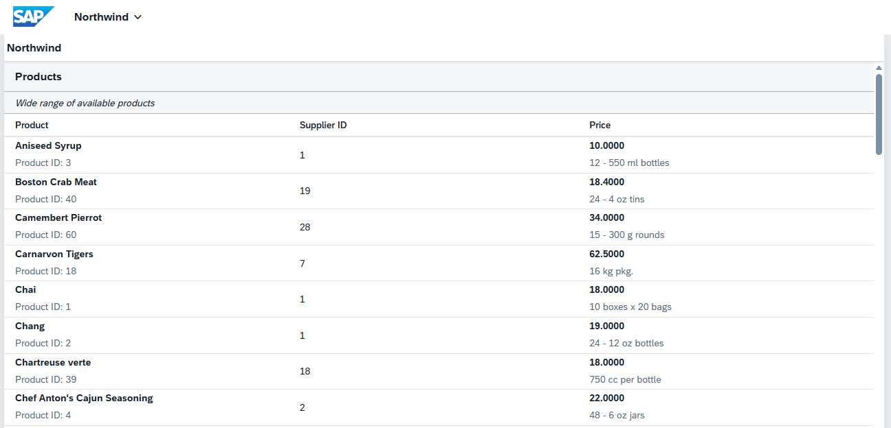

# [SAP Fiori Capability] SAPUI5 Basic Training
## DAY 7 - OData Service Activity

* Main View shows a table with list of Products from [Northwind Service](https://services.odata.org/V2/Northwind/Northwind.svc/Products?$format=json).

    * Product column shows the ProductName and ProductID.
    * Supplier ID column shows the SupplierID.
    * Price column shows the UnitPrice and QuantityPerUnit.

* Table is sorted by Product Name.

* Filter is added to exclude Discontinued Products in the view.

    
    *Output - Products Table*
